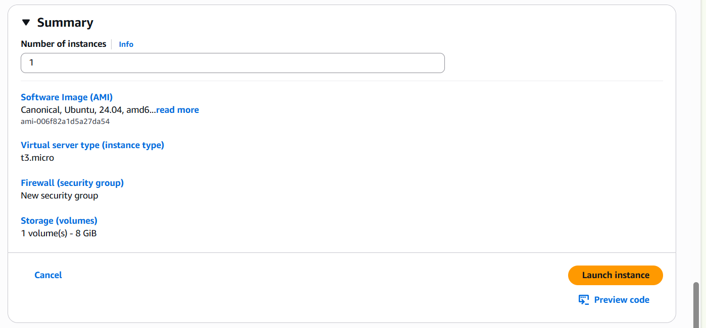
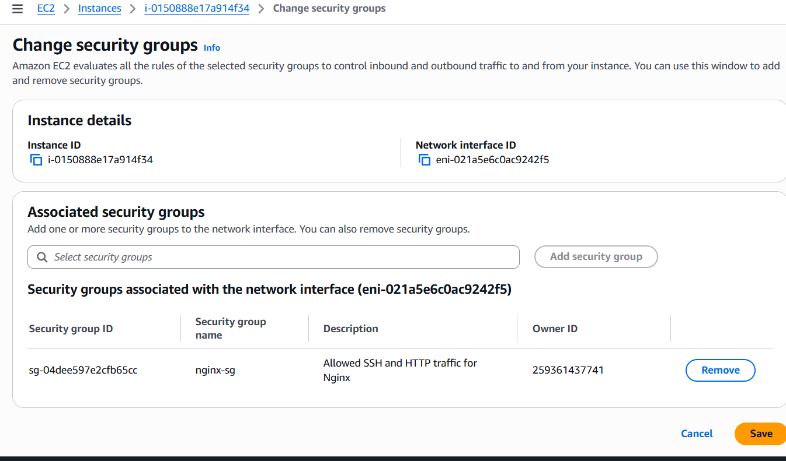
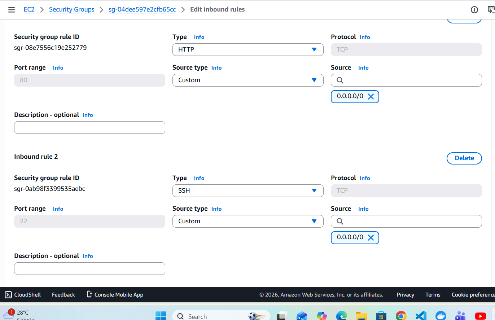
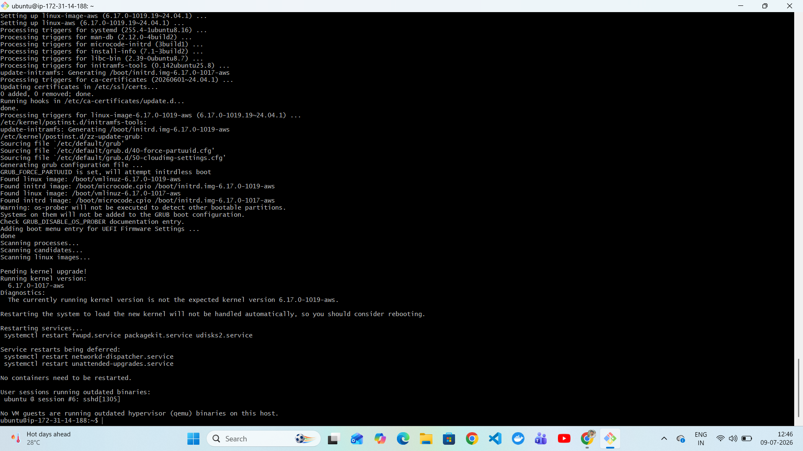
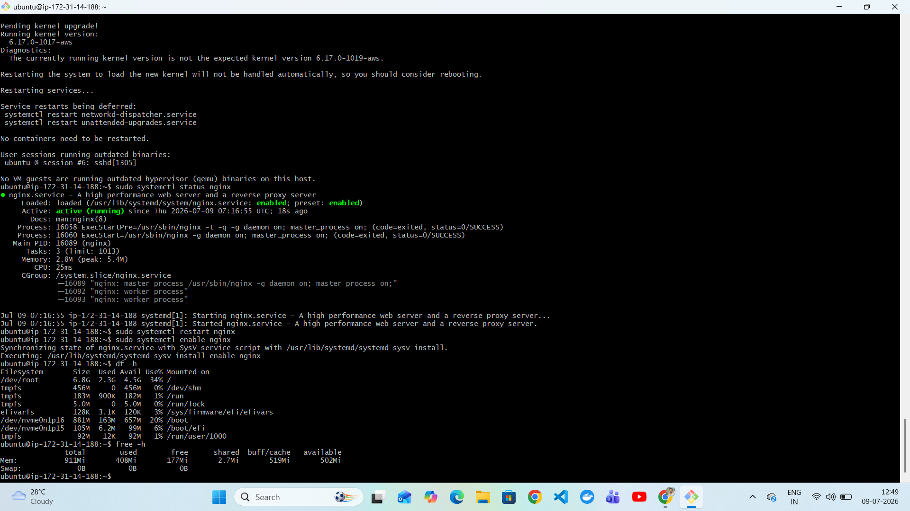
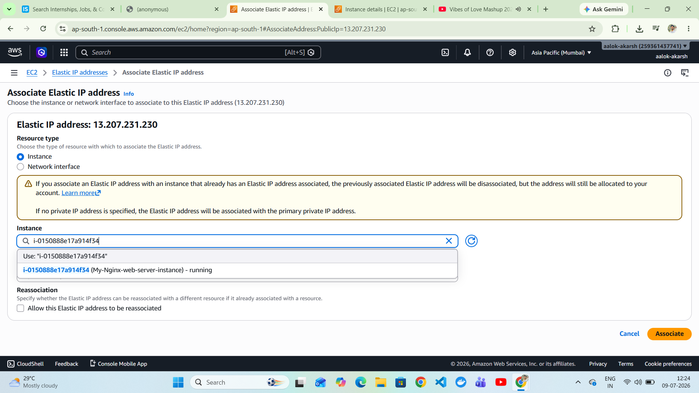
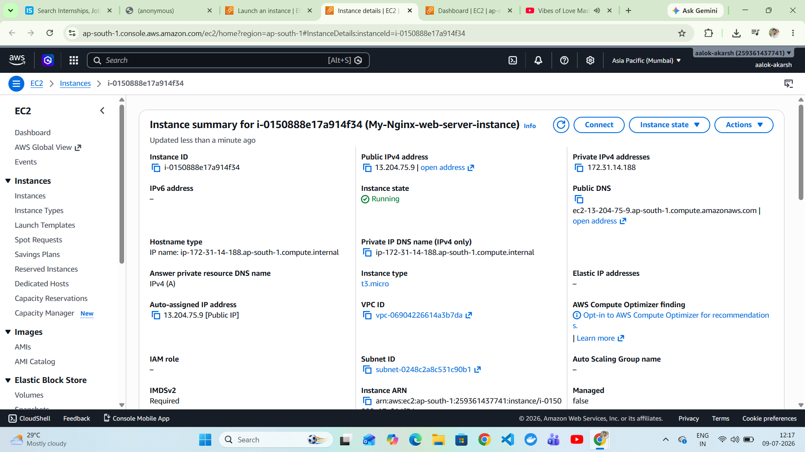
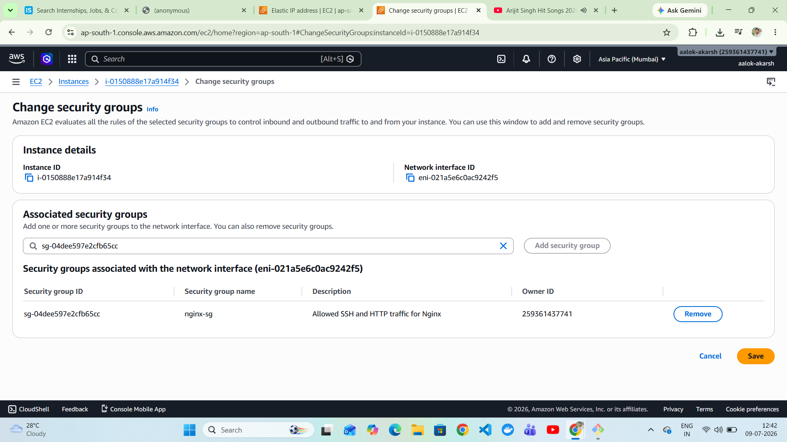
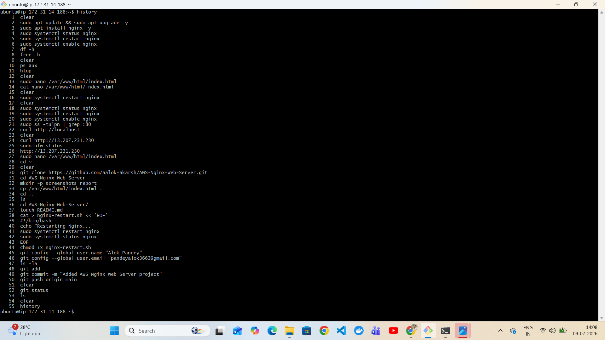

# 🚀 AWS Nginx Web Server

A production-style static website deployment on **AWS EC2 (Ubuntu 24.04 LTS)** using **Nginx**. This project demonstrates AWS infrastructure provisioning, Linux administration, web server configuration, Git/GitHub version control, and static website hosting.


---

# 📋 Project Overview

This project demonstrates how to:

- Launch an Ubuntu EC2 instance
- Configure Security Groups
- Connect using SSH
- Install and configure Nginx
- Deploy a static HTML website
- Associate an Elastic IP
- Manage Linux services
- Upload the project to GitHub

---

# 🏗️ Architecture

```
                 Internet
                     │
                     ▼
          Elastic IP (13.207.231.230)
                     │
                     ▼
      AWS Security Group (22,80)
                     │
                     ▼
      Ubuntu EC2 (t2.micro)
                     │
                     ▼
             Nginx Web Server
                     │
                     ▼
      /var/www/html/index.html
```

---

# 🛠 Technologies Used

- AWS EC2
- Ubuntu Server 24.04 LTS
- Nginx
- Linux
- Git
- GitHub
- SSH

---

# ☁️ AWS Services Used

- Amazon EC2
- Security Groups
- Elastic IP

---

# 📂 Project Structure

```
AWS-Nginx-Web-Server/
│
├── index.html
├── README.md
├── nginx-restart.sh
├── screenshots/
└── report/
```

---

# 1️⃣ Launch EC2 Instance

Created an Ubuntu EC2 instance and configured networking.



---

# 2️⃣ Configure Security Group

Allowed inbound traffic for SSH (22) and HTTP (80).



Additional inbound rule verification.



---

# 3️⃣ Connect to EC2 via SSH

Successfully connected using the generated key pair.


---

# 4️⃣ Update Ubuntu Packages

```bash
sudo apt update
sudo apt upgrade -y
```



---

# 5️⃣ Install Nginx

```bash
sudo apt install nginx -y
```

Enable Nginx

```bash
sudo systemctl enable nginx
```

Restart Nginx

```bash
sudo systemctl restart nginx
```



---

# 6️⃣ Linux Administration Commands

Disk Usage

```bash
df -h
```

Memory Usage

```bash
free -h
```

Processes

```bash
ps aux
```

Process Monitoring


System Monitoring


---

# 7️⃣ Deploy Static Website

Replaced the default Nginx page.

```bash
sudo nano /var/www/html/index.html
```


---

# 8️⃣ Website Accessible

The website is successfully accessible through the browser.


Command-line verification.


---

# 9️⃣ Associate Elastic IP

Created and associated an Elastic IP to ensure a static public IP.




---

# 🔟 EC2 Configuration Summary

Instance Details



Updated Security Group


Security Group Verification



---

# 💻 Commands Used

```bash
sudo apt update
sudo apt upgrade -y
sudo apt install nginx -y
sudo systemctl status nginx
sudo systemctl restart nginx
sudo systemctl enable nginx
df -h
free -h
ps aux
htop
```

Command Execution



---

# 📜 Bonus Task

Shell script to restart Nginx.

```bash
#!/bin/bash

echo "Restarting Nginx..."
sudo systemctl restart nginx
sudo systemctl status nginx
```

Run

```bash
./nginx-restart.sh
```

---

# 📚 Learning Outcomes

- AWS EC2 provisioning
- Security Group configuration
- Linux administration
- Nginx installation and configuration
- Static website deployment
- Elastic IP association
- Git & GitHub workflow
- SSH remote administration

---

# 👨‍💻 Author

**Alok Pandey**

- GitHub: https://github.com/aalok-akarsh

---

# ⭐ Repository

If you found this project helpful, consider giving it a ⭐ on GitHub.
