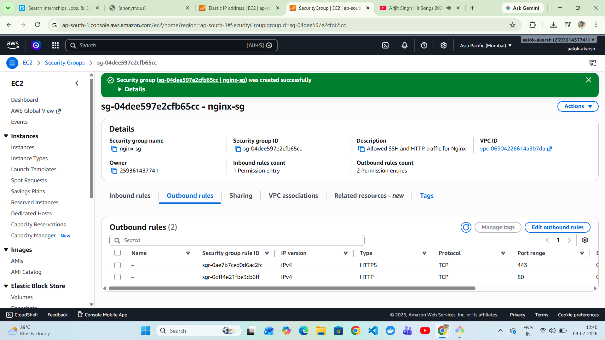
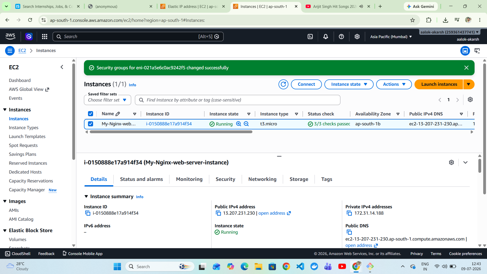
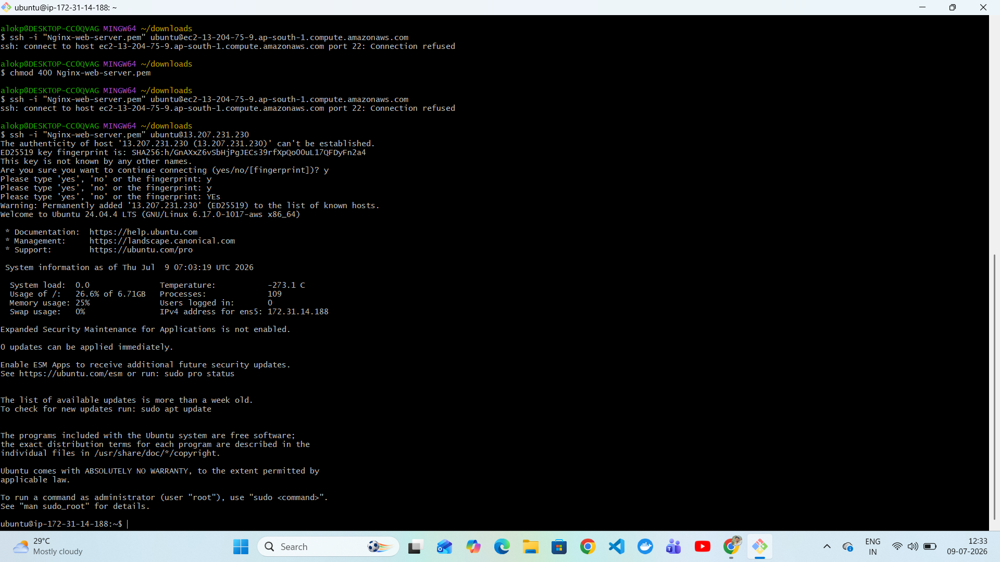
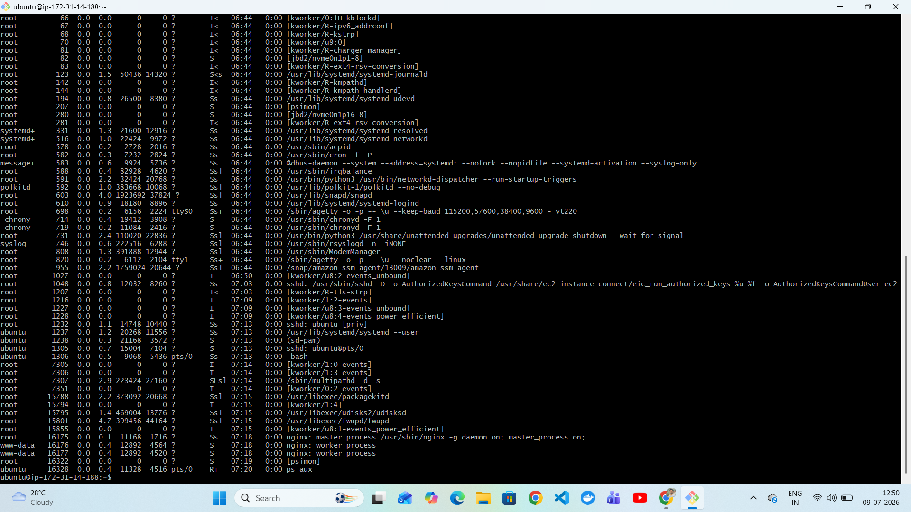
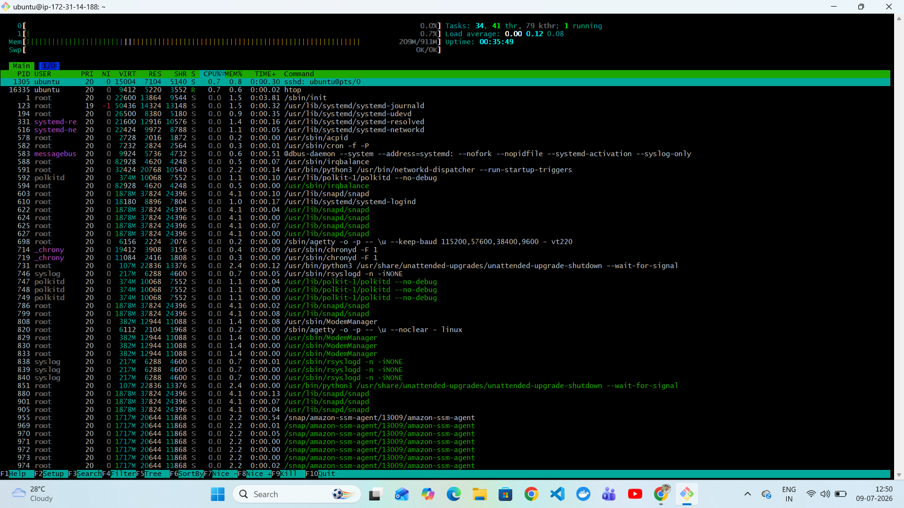
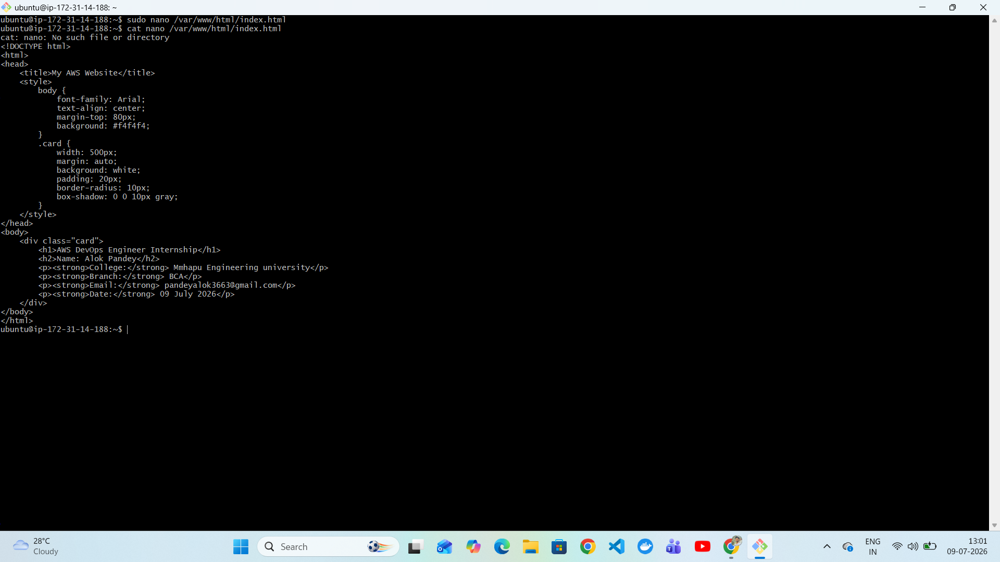
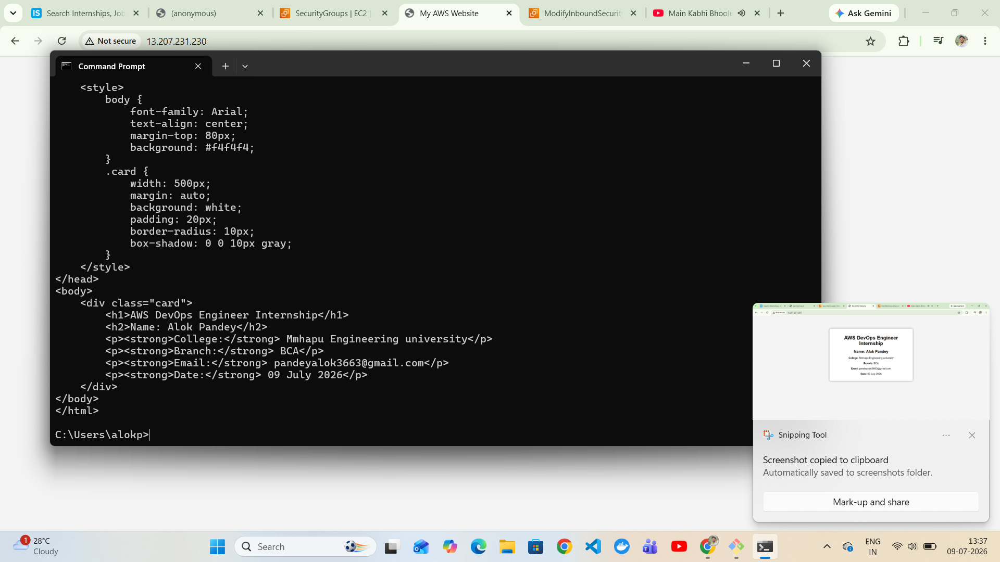
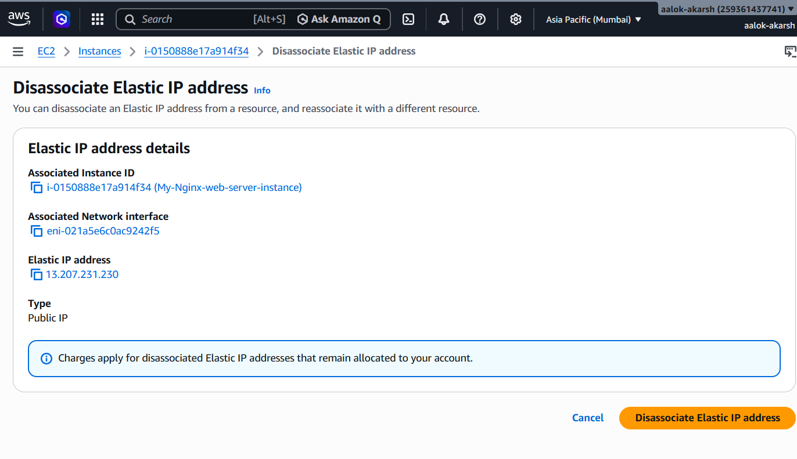

# 🚀 AWS Nginx Web Server

A simple static website hosted on an **AWS EC2 Ubuntu 24.04 LTS** instance using the **Nginx Web Server**. This project was completed as part of an **AWS DevOps Engineer Intern Assignment** and demonstrates AWS infrastructure setup, Linux administration, web server deployment, Git/GitHub workflow, and technical documentation.

---

## 📖 Project Overview

This project covers the complete deployment of a static HTML website on AWS EC2 using Nginx.

### Objectives

- Launch an Ubuntu EC2 instance
- Configure AWS Security Groups
- Connect to the server using SSH
- Install and manage Nginx
- Deploy a custom HTML website
- Associate an Elastic IP (Bonus)
- Upload the project to GitHub
- Document the complete deployment process

---

# 🏗️ Architecture

```
                    Internet
                         │
                         ▼
                Elastic IP (Public IP)
                         │
                         ▼
              AWS Security Group
              (SSH 22 | HTTP 80)
                         │
                         ▼
             Ubuntu EC2 Instance (t2.micro)
                         │
                         ▼
                 Nginx Web Server
                         │
                         ▼
             /var/www/html/index.html
                         │
                         ▼
                   Static Website
```

---

# 🛠 Technologies Used

- Amazon EC2
- Ubuntu Server 24.04 LTS
- Nginx
- Linux
- Git
- GitHub
- SSH

---

# ☁️ AWS Services Used

- Amazon EC2
- Security Groups
- Elastic IP

---

# 📂 Project Structure

```
AWS-Nginx-Web-Server/
│
├── index.html
├── README.md
├── nginx-restart.sh
├── screenshots/
│   ├── ec2-instance-summary.png
│   ├── security-group-created.png
│   ├── security-group.png
│   ├── inbound-rules.png
│   ├── ssh-connection.png
│   ├── ubuntu-system-update.png
│   ├── nginx-running.png
│   ├── website-source-code.png
│   ├── website-browser.png
│   ├── curl-verification.png
│   ├── elastic-ip-attached.png
│   ├── running-processes.png
│   ├── htop-monitoring.png
│   └── ...
│
└── report/
    └── AWS_DevOps_Report.pdf
```

---

# ✅ Task 1 – Create an AWS EC2 Instance

## Launch Ubuntu EC2 Instance

Created an Ubuntu Server 24.04 LTS EC2 instance.


---

## Create Security Group

Configured a Security Group allowing:

- SSH (22)
- HTTP (80)



---

## Verify Security Group


### Inbound Rules


### Updated Security Group



---

## Connect to EC2 via SSH

Successfully connected using SSH.



---

# ✅ Task 2 – Linux Basics

## Update Packages

```bash
sudo apt update
sudo apt upgrade -y
```


---

## Install Nginx

```bash
sudo apt install nginx -y
```

---

## Enable Nginx

```bash
sudo systemctl enable nginx
```

---

## Restart Nginx

```bash
sudo systemctl restart nginx
```

---

## Check Nginx Status

```bash
sudo systemctl status nginx
```


---

## Disk Usage

```bash
df -h
```

---

## Memory Usage

```bash
free -h
```

---

## Running Processes

```bash
ps aux
```



---

## Process Monitoring

```bash
htop
```



---

# ✅ Task 3 – Host a Simple Website

The default Nginx page was replaced with a custom HTML page containing:

- Name
- College
- Branch
- Email
- Current Date

### Edit Website

```bash
sudo nano /var/www/html/index.html
```



---

## Website Accessible from Browser

```
http://13.207.231.230
```


---

## Verify Using curl

```bash
curl http://13.207.231.230
```



---

# ✅ Task 4 – Git & GitHub

Repository:

**https://github.com/aalok-akarsh/AWS-Nginx-Web-Server**

### Git Commands Used

```bash
git init

git add .

git commit -m "Initial Commit"

git branch -M main

git remote add origin https://github.com/aalok-akarsh/AWS-Nginx-Web-Server.git

git push -u origin main
```

---

# ✅ Task 5 – Documentation

The project documentation includes:

- AWS Services Used
- Linux Commands
- Problems Faced
- Learnings
- Time Taken

The report is available inside:

```
report/AWS_DevOps_Report.pdf
```

---

# ⭐ Bonus Task

## Elastic IP

Associated an Elastic IP with the EC2 instance.




---

## Nginx Restart Script

```bash
#!/bin/bash

echo "Restarting Nginx..."

sudo systemctl restart nginx

sudo systemctl status nginx
```

Run:

```bash
chmod +x nginx-restart.sh

./nginx-restart.sh
```

---

# 💻 Linux Commands Used

```bash
sudo apt update

sudo apt upgrade -y

sudo apt install nginx -y

sudo systemctl enable nginx

sudo systemctl restart nginx

sudo systemctl status nginx

df -h

free -h

ps aux

htop

curl http://13.207.231.230
```

---

# ⚠️ Problems Faced

- Browser initially displayed **"This site can't be reached"**
- HTTP port was not accessible until Security Group rules were verified
- Elastic IP was attached to maintain a static public IP
- Git push conflicts were resolved by fetching and rebasing remote changes
- Renamed screenshot files for consistent documentation

---

# 📚 Learning Outcomes

- AWS EC2 provisioning
- Security Group configuration
- SSH connectivity
- Linux system administration
- Installing and managing Nginx
- Hosting static websites
- Elastic IP management
- Git and GitHub version control
- Technical project documentation

---

# 📸 Project Screenshots

| Description | Screenshot |
|------------|------------|
| EC2 Instance |  |
| Security Group |  |
| SSH Login |  |
| Ubuntu Update |  |
| Nginx Running |  |
| Website |  |
| Elastic IP |  |

---

# 👨‍💻 Author

**Alok Pandey**

- GitHub: https://github.com/aalok-akarsh

---

# 📄 License

This project was created for educational and internship demonstration purposes.
